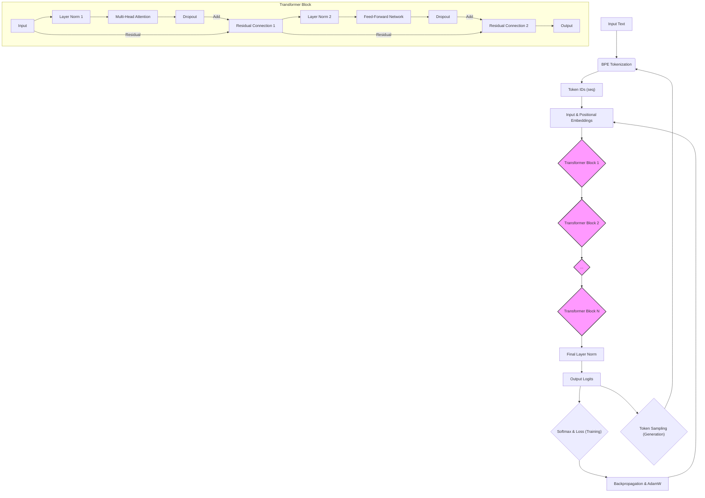

# GPT-2 Style Transformer in AWK: Comprehensive Documentation

This document provides a detailed explanation of a GPT-2 style transformer implementation written entirely in AWK. It aims to demystify the complex concepts behind modern large language models, making them accessible even to beginners. The documentation covers the architecture, data flow, function-level details, backpropagation mechanics, training procedures, and underlying mathematical formulas.

## 1. Architecture Overview

The AWK transformer implements a decoder-only architecture, similar to GPT-2, designed for sequence-to-sequence tasks like text generation. The overall flow involves tokenization, embedding, processing through multiple transformer blocks, and finally, outputting logits for the next token prediction. The training process incorporates a full backpropagation pass with the AdamW optimizer.

Here's a high-level overview of the architecture:



**Explanation of the Architecture Flow:**

1.  **Input Text**: Raw text data is fed into the system.
2.  **BPE Tokenization**: The text is broken down into subword units (tokens) using the Byte Pair Encoding algorithm. This handles rare words and allows for a manageable vocabulary size.
3.  **Token IDs**: Each token is converted into a numerical ID.
4.  **Input & Positional Embeddings**: Token IDs are mapped to dense vector representations (input embeddings). Positional embeddings are added to these to inject information about the token's position in the sequence.
5.  **Transformer Blocks**: The core of the model. The embedded tokens pass through a stack of `N` identical transformer blocks. Each block refines the representation of each token by considering its context.
6.  **Final Layer Norm**: A final layer normalization is applied to the output of the last transformer block.
7.  **Output Logits**: The normalized output is projected to the size of the vocabulary, producing raw prediction scores (logits) for each possible next token.
8.  **Softmax & Loss (Training)**: During training, these logits are converted into probabilities via a softmax function, and a cross-entropy loss is calculated against the true next token. This loss guides the learning process.
9.  **Token Sampling (Generation)**: During text generation, the logits are used to sample the next token, which is then appended to the input sequence, and the process repeats.
10. **Backpropagation & AdamW**: In training, the calculated loss is backpropagated through the network to compute gradients for all model parameters. The AdamW optimizer uses these gradients to update the parameters, minimizing the loss.

### Transformer Block Details

Each transformer block processes its input through several sub-layers:

*   **Layer Norm 1**: Normalizes the input to the multi-head attention sub-layer.
*   **Multi-Head Attention**: Allows the model to jointly attend to information from different representation subspaces at different positions. It computes Query, Key, and Value vectors, calculates attention scores, and produces a weighted sum of Value vectors.
*   **Dropout**: Randomly sets a fraction of inputs to zero during training to prevent overfitting.
*   **Residual Connection 1**: Adds the input of the sub-layer to its output (after normalization and dropout). This helps in training deeper networks.
*   **Layer Norm 2**: Normalizes the input to the feed-forward network sub-layer.
*   **Feed-Forward Network (FFN)**: A simple two-layer neural network with a GELU activation function, applied independently to each position.
*   **Dropout**: Applies dropout to the FFN output.
*   **Residual Connection 2**: Adds the input of the FFN sub-layer to its output (after normalization and dropout).

## 2. BPE Tokenization and Example Walkthrough

Byte Pair Encoding (BPE) is a subword tokenization algorithm that effectively balances vocabulary size and sequence length. It works by iteratively merging the most frequent adjacent character or character-sequence pairs in a text corpus.

Let's consider the example sentences for training: "I love cat. I am using cat commant to open file"

### BPE Training Process (Simplified)

1.  **Initial Vocabulary**: The initial vocabulary consists of all unique characters in the corpus: `{'I', ' ', 'l', 'o', 'v', 'e', 'c', 'a', 't', '.', 'm', 'u', 's', 'i', 'n', 'g', 'o', 'm', 'n', 'f', 'i', 'l', 'e'}`.
2.  **Iterative Merging**: The `train_bpe` function repeatedly finds the most frequent adjacent pair and merges them. For instance:
    *   The pair `('c', 'a')` might be very frequent, merging to `('ca')`.
    *   Then `('ca', 't')` might merge to `('cat')`.
    *   Similarly, `('co', 'm')` might merge to `('com')`, then `('com', 'm')` to `('comm')`, and so on.
    *   The space character ` ` is also treated as a token, allowing for subword units like `_cat` (where `_` represents a space).
3.  **Final Vocabulary**: After `num_merges` steps, a vocabulary of subword units is formed. For our example, `cat` would likely become a single token due to its frequency.

### Tokenization of Example Sentences

Using the trained BPE merges, the `tokenize_bpe` function converts the input sentences into a sequence of token IDs.

**Sentence 1**: "I love cat."

*   This might be tokenized into `['I', '_love', '_cat', '.']` (where `_` denotes a space-prefixed token).
*   Each of these tokens (`I`, `_love`, `_cat`, `.`) would then be mapped to a unique numerical ID from the `token2id` mapping.

**Sentence 2**: "I am using cat commant to open file"

*   This might be tokenized into `['I', '_am', '_using', '_cat', '_commant', '_to', '_open', '_file']`.
*   Notice that `cat` appears as a single token in both sentences, demonstrating BPE's ability to handle common words efficiently.

### Self-Attention on the word "cat"

When the model processes the token `_cat` (or `cat` if spaces are handled differently) in the sentence "I love cat.", the self-attention mechanism allows it to weigh the importance of all other tokens in the sequence (`I`, `_love`, `.`) when forming a new representation for `_cat`.

Specifically, for the token `_cat` at position `t`:

1.  **Query (Q)**: A query vector is generated from `_cat`'s embedding.
2.  **Key (K)**: Key vectors are generated from the embeddings of all tokens in the sequence, including `_cat` itself, `I`, `_love`, and `.`.
3.  **Attention Scores**: The query vector of `_cat` is compared (dot-product) with the key vectors of all other tokens. This produces a score indicating how 


## 3. Function Documentation

This section provides detailed documentation for each function implemented in the `transformerV3.awk` script, including their purpose, parameters, and return values.

### BPE Tokenization Functions

#### `tanh(x)`
**Description:** Computes the hyperbolic tangent of `x`. It includes clamping to prevent numerical instability for very large or small inputs.
**Parameters:**
* `x` (number): The input value.
**Returns:**
* (number): The hyperbolic tangent of `x`.
**Sample Input/Output:**
```awk
# Input
x = 0.5
result = tanh(x)
# Output (approx)
# result = 0.4621
```

#### `get_pair_stats(tokens, n, stats)`
**Description:** Calculates the frequency of adjacent token pairs in a given sequence. This is a core step in the Byte Pair Encoding (BPE) algorithm.
**Parameters:**
* `tokens` (array): An array of tokens (strings).
* `n` (number): The number of tokens in the `tokens` array.
* `stats` (array, by reference): An associative array to store the counts of each token pair. Keys are `token1 OFS token2`.
**Returns:**
* (void): Modifies the `stats` array by reference.
**Sample Input/Output:**
```awk
# Input
tokens[1] = "a"; tokens[2] = "b"; tokens[3] = "a"; tokens[4] = "b"; tokens[5] = "c"
n = 5
delete stats # Ensure stats is empty initially
get_pair_stats(tokens, n, stats)
# Output (stats array)
# stats["a\tb"] = 2
# stats["b\ta"] = 1
# stats["b\tc"] = 1
```

#### `merge_sequence(tokens, n, pair_str, new_token, new_tokens, new_n, p1, p2, pair_parts)`
**Description:** Merges occurrences of a specific token pair into a new single token within a sequence. This is another fundamental operation in BPE.
**Parameters:**
* `tokens` (array): The input array of tokens (modified in place).
* `n` (number): The current number of tokens in the `tokens` array.
* `pair_str` (string): The token pair to merge, e.g., "a\tb".
* `new_token` (string): The new token to replace the merged pair, e.g., "ab".
* `new_tokens` (array, local): Temporary array for storing the merged sequence.
* `new_n` (number, local): New length of the sequence.
* `p1`, `p2`, `pair_parts` (local): Variables used for splitting `pair_str`.
**Returns:**
* (number): The new length of the `tokens` array after merging.
**Sample Input/Output:**
```awk
# Input
tokens[1] = "a"; tokens[2] = "b"; tokens[3] = "a"; tokens[4] = "b"; tokens[5] = "c"
n = 5
pair_str = "a\tb"
new_token = "ab"
n_new = merge_sequence(tokens, n, pair_str, new_token)
# Output (tokens array and n_new)
# tokens[1] = "ab"; tokens[2] = "ab"; tokens[3] = "c"
# n_new = 3
```

#### `train_bpe(text, num_merges)`
**Description:** Implements the Byte Pair Encoding (BPE) algorithm to build a vocabulary and a set of merge rules from a given text corpus. It iteratively finds the most frequent adjacent character/token pair and merges them until `num_merges` is reached or no more merges are possible.
**Parameters:**
* `text` (string): The input text corpus for BPE training.
* `num_merges` (number): The maximum number of merge operations to perform.
**Returns:**
* (void): Populates global arrays `token2id`, `id2token`, `ranked_merges`, and `V` (vocabulary size).
**Sample Input/Output:**
```awk
# Input
text = "banana"
num_merges = 2
# Call
train_bpe(text, num_merges)
# Output (global variables, simplified for example)
# V = 4 (e.g., 'b', 'a', 'n', 'an')
# token2id["b"] = 1, token2id["a"] = 2, token2id["n"] = 3, token2id["an"] = 4
# id2token[1] = "b", id2token[2] = "a", id2token[3] = "n", id2token[4] = "an"
# num_ranked_merges = 2
# ranked_merges[1, "p1"] = "a", ranked_merges[1, "p2"] = "n", ranked_merges[1, "new"] = "an"
# ranked_merges[2, "p1"] = "an", ranked_merges[2, "p2"] = "a", ranked_merges[2, "new"] = "ana"
```

#### `tokenize_bpe(text, seq_out)`
**Description:** Tokenizes an input text using the previously learned BPE merge rules and vocabulary. It converts the text into a sequence of token IDs.
**Parameters:**
* `text` (string): The input text to tokenize.
* `seq_out` (string): A string indicating which global array to store the token IDs in ("seq_full" or "out_idx").
**Returns:**
* (number): The number of tokens in the resulting sequence.
**Sample Input/Output:**
```awk
# Pre-requisite: `train_bpe` has been called to populate `token2id`, `id2token`, `ranked_merges`.
# Input
text = "banana"
seq_out = "out_idx"
# Call
T = tokenize_bpe(text, seq_out)
# Output (global array `out_idx` and T)
# Assuming 'b'->1, 'a'->2, 'n'->3, 'an'->4, 'ana'->5
# out_idx[1] = 1 (for 'b')
# out_idx[2] = 5 (for 'ana')
# out_idx[3] = 2 (for 'a')
# T = 3
```

### Math Functions and Helpers

#### `idx(i, j, cols)`
**Description:** Calculates a 1D index for a 2D array (matrix) stored in a 1D associative array, given row `i`, column `j`, and the total number of `cols` in the matrix.
**Parameters:**
* `i` (number): Row index (1-based).
* `j` (number): Column index (1-based).
* `cols` (number): Number of columns in the matrix.
**Returns:**
* (number): The 1D index.
**Sample Input/Output:**
```awk
# Input
i = 2; j = 3; cols = 4
result = idx(i, j, cols)
# Output
# result = 7 (meaning (2-1)*4 + 3 = 7)
```

#### `dot_row(A, ri, B, rj, d)`
**Description:** Computes the dot product of row `ri` from matrix `A` and row `rj` from matrix `B`. Both matrices are assumed to be stored in 1D associative arrays using the `idx` function, and `d` is their common dimension.
**Parameters:**
* `A` (array): The first matrix (1D associative array).
* `ri` (number): Row index in `A`.
* `B` (array): The second matrix (1D associative array).
* `rj` (number): Row index in `B`.
* `d` (number): The dimension of the vectors (number of columns).
**Returns:**
* (number): The dot product.
**Sample Input/Output:**
```awk
# Input (assuming d=2)
A[idx(1,1,2)] = 1; A[idx(1,2,2)] = 2
A[idx(2,1,2)] = 3; A[idx(2,2,2)] = 4
B[idx(1,1,2)] = 5; B[idx(1,2,2)] = 6
B[idx(2,1,2)] = 7; B[idx(2,2,2)] = 8
ri = 1; rj = 2; d = 2
result = dot_row(A, ri, B, rj, d)
# Output
# result = (A[1,1]*B[2,1] + A[1,2]*B[2,2]) = (1*7 + 2*8) = 7 + 16 = 23
```

#### `clamp_inplace(A, n, val)`
**Description:** Clamps the values in array `A` (of size `n`) between `-val` and `val` in-place. Used for gradient clipping.
**Parameters:**
* `A` (array): The array to be clamped (modified in place).
* `n` (number): The number of elements in array `A`.
* `val` (number): The maximum absolute value for elements.
**Returns:**
* (void): Modifies array `A` in place.
**Sample Input/Output:**
```awk
# Input
A[1] = 10; A[2] = -5; A[3] = 2; n = 3; val = 5
clamp_inplace(A, n, val)
# Output (A array)
# A[1] = 5
# A[2] = -5
# A[3] = 2
```

#### `safe_exp(x)`
**Description:** Computes the exponential of `x`, returning 0 if `x` is very small to prevent underflow issues.
**Parameters:**
* `x` (number): The input value.
**Returns:**
* (number): `exp(x)` or 0 if `x < -700`.
**Sample Input/Output:**
```awk
# Input
x1 = 1; x2 = -800
result1 = safe_exp(x1)
result2 = safe_exp(x2)
# Output
# result1 = 2.71828...
# result2 = 0
```

#### `safe_div(a, b)`
**Description:** Performs division `a / b`, returning 0 if the denominator `b` is zero to prevent division-by-zero errors.
**Parameters:**
* `a` (number): Numerator.
* `b` (number): Denominator.
**Returns:**
* (number): `a / b` or 0 if `b` is 0.
**Sample Input/Output:**
```awk
# Input
a1 = 10; b1 = 2
a2 = 5; b2 = 0
result1 = safe_div(a1, b1)
result2 = safe_div(a2, b2)
# Output
# result1 = 5
# result2 = 0
```

#### `gelu(x)`
**Description:** Implements the Gaussian Error Linear Unit (GELU) activation function, which is commonly used in transformer models. It uses an approximation for the Gaussian Cumulative Distribution Function (CDF).
**Parameters:**
* `x` (number): The input value.
**Returns:**
* (number): The GELU activated value.
**Sample Input/Output:**
```awk
# Input
x = 0.5
result = gelu(x)
# Output (approx)
# result = 0.3457
```

#### `gelu_derivative(x)`
**Description:** Computes the derivative of the GELU activation function with respect to `x`. This is crucial for backpropagation.
**Parameters:**
* `x` (number): The input value.
**Returns:**
* (number): The derivative of GELU at `x`.
**Sample Input/Output:**
```awk
# Input
x = 0.5
result = gelu_derivative(x)
# Output (approx)
# result = 0.8459
```

#### `xavier_init(fan_in, fan_out)`
**Description:** Implements Xavier (Glorot) weight initialization, suitable for layers with `tanh` or `sigmoid` activations. It helps in maintaining signal variance across layers.
**Parameters:**
* `fan_in` (number): Number of input units.
* `fan_out` (number): Number of output units.
**Returns:**
* (number): An initialized weight value.
**Sample Input/Output:**
```awk
# Input
fan_in = 10; fan_out = 20
result = xavier_init(fan_in, fan_out)
# Output (random value, e.g.)
# result = 0.1234
```

#### `kaiming_init(fan_in)`
**Description:** Implements Kaiming He initialization, typically used for layers with ReLU-like activations. It scales weights based on the number of input units.
**Parameters:**
* `fan_in` (number): Number of input units.
**Returns:**
* (number): An initialized weight value.
**Sample Input/Output:**
```awk
# Input
fan_in = 10
result = kaiming_init(fan_in)
# Output (random value, e.g.)
# result = 0.0567
```

### AdamW Optimizer Functions

#### `adamw_init_optimizer()`
**Description:** Initializes the momentum (`m_`) and variance (`v_`) arrays for all trainable parameters (embeddings, weights, biases, layer norm parameters) used by the AdamW optimizer. Sets `adam_t` (time step) to 0.
**Parameters:**
* (none): Uses global variables like `V`, `d`, `block_size`, `n_layers`, `d_ff`.
**Returns:**
* (void): Initializes global `m_` and `v_` arrays.
**Sample Input/Output:**
```awk
# Call
adamw_init_optimizer()
# Output (global arrays initialized to 0)
# m_E[1] = 0, v_E[1] = 0, ...
# m_WQs[1,1] = 0, v_WQs[1,1] = 0, ...
```

#### `adamw_update(param, grad, m, v, n, decay)`
**Description:** Updates a single parameter array using the AdamW optimization algorithm. It calculates biased and bias-corrected first and second moment estimates, then applies the update with optional weight decay.
**Parameters:**
* `param` (array, by reference): The parameter array to update (e.g., `E`, `WQs[l]`).
* `grad` (array): The gradient array for `param` (e.g., `dE_acc`, `dWQs_acc[l]`).
* `m` (array, by reference): The first moment (momentum) array for `param`.
* `v` (array, by reference): The second moment (variance) array for `param`.
* `n` (number): The size of the parameter array.
* `decay` (boolean): Flag indicating whether to apply weight decay.
**Returns:**
* (void): Modifies `param`, `m`, and `v` arrays in place.
**Sample Input/Output:**
```awk
# Input (simplified example)
param[1] = 0.1; param[2] = 0.2
grad[1] = 0.01; grad[2] = -0.005
m[1] = 0; m[2] = 0
v[1] = 0; v[2] = 0
n = 2; decay = 1
adam_t = 1; lr = 0.001; beta1 = 0.9; beta2 = 0.999; epsilon = 1e-8; weight_decay = 0.01
# Call
adamw_update(param, grad, m, v, n, decay)
# Output (param, m, v arrays updated based on AdamW formulas)
# param[1] = 0.0999..., param[2] = 0.2000...
# m[1] = 0.001, m[2] = -0.0005
# v[1] = 0.000001, v[2] = 0.00000025
```

#### `adamw_update_all()`
**Description:** Increments the global `adam_t` (time step) and then calls `adamw_update` for all trainable parameters in the model (embeddings, positional encodings, all layer weights and biases, and layer normalization parameters).
**Parameters:**
* (none): Uses global parameter and gradient arrays.
**Returns:**
* (void): Updates all model parameters.
**Sample Input/Output:**
```awk
# Call
adamw_update_all()
# Output: All model parameters are updated based on their accumulated gradients.
```

#### `reset_gradients()`
**Description:** Clears all accumulated gradients (`d*_acc` arrays) by deleting them. This is typically called at the beginning of each training step (or gradient accumulation step) to ensure gradients are accumulated from scratch.
**Parameters:**
* (none): Operates on global gradient arrays.
**Returns:**
* (void): Clears global gradient arrays.
**Sample Input/Output:**
```awk
# Call
reset_gradients()
# Output: All d*_acc arrays are emptied.
# For example, dE_acc is deleted.
```

### Neural Network Layers

#### `layernorm_forward(inp, out, gamma, beta, mean_cache, inv_std_cache, d, block_len)`
**Description:** Performs the forward pass of Layer Normalization. It normalizes the input `inp` across the feature dimension `d` for each token in a block of `block_len`, then scales by `gamma` and shifts by `beta`. It caches `mean` and `inv_std` for use in backpropagation.
**Parameters:**
* `inp` (array): Input tensor (block_len x d).
* `out` (array, by reference): Output tensor (block_len x d).
* `gamma` (array): Learnable scaling parameter (d).
* `beta` (array): Learnable shifting parameter (d).
* `mean_cache` (array, by reference): Cache for mean values (block_len).
* `inv_std_cache` (array, by reference): Cache for inverse standard deviation values (block_len).
* `d` (number): Dimension of the features.
* `block_len` (number): Number of tokens in the current block.
**Returns:**
* (void): Populates `out`, `mean_cache`, and `inv_std_cache`.
**Sample Input/Output:**
```awk
# Input (simplified for d=2, block_len=1)
inp[idx(1,1,2)] = 1; inp[idx(1,2,2)] = 3
gamma[1] = 1; gamma[2] = 1
beta[1] = 0; beta[2] = 0
d = 2; block_len = 1
# Call
layernorm_forward(inp, out, gamma, beta, mean_cache, inv_std_cache, d, block_len)
# Output (out, mean_cache, inv_std_cache)
# mean = (1+3)/2 = 2
# var = ((1-2)^2 + (3-2)^2)/2 = (1+1)/2 = 1
# inv_std = 1/sqrt(1 + 1e-5) approx 1
# out[idx(1,1,2)] = (1-2)*1 = -1
# out[idx(1,2,2)] = (3-2)*1 = 1
# mean_cache[1] = 2
# inv_std_cache[1] = 1
```

#### `layernorm_backward(d_out, inp, d_inp, gamma, d_gamma, d_beta, mean_cache, inv_std_cache, d, block_len)`
**Description:** Performs the backward pass for Layer Normalization. It computes gradients with respect to the input `inp`, `gamma`, and `beta` using the cached `mean` and `inv_std` from the forward pass.
**Parameters:**
* `d_out` (array): Gradient of the loss with respect to the output of the layer norm.
* `inp` (array): Input to the layer norm (from forward pass).
* `d_inp` (array, by reference): Gradient of the loss with respect to the input of the layer norm.
* `gamma` (array): Learnable scaling parameter.
* `d_gamma` (array, by reference): Gradient of the loss with respect to `gamma`.
* `d_beta` (array, by reference): Gradient of the loss with respect to `beta`.
* `mean_cache` (array): Cached mean values from forward pass.
* `inv_std_cache` (array): Cached inverse standard deviation values from forward pass.
* `d` (number): Dimension of the features.
* `block_len` (number): Number of tokens in the current block.
**Returns:**
* (void): Populates `d_inp`, `d_gamma`, and `d_beta`.
**Sample Input/Output:**
```awk
# Input (simplified for d=2, block_len=1, using forward pass outputs)
d_out[idx(1,1,2)] = 0.1; d_out[idx(1,2,2)] = 0.2
inp[idx(1,1,2)] = 1; inp[idx(1,2,2)] = 3
gamma[1] = 1; gamma[2] = 1
mean_cache[1] = 2; inv_std_cache[1] = 1
d = 2; block_len = 1
# Call
layernorm_backward(d_out, inp, d_inp, gamma, d_gamma, d_beta, mean_cache, inv_std_cache, d, block_len)
# Output (d_inp, d_gamma, d_beta, simplified)
# d_gamma[1] = -0.1; d_gamma[2] = 0.2
# d_beta[1] = 0.1; d_beta[2] = 0.2
# d_inp[idx(1,1,2)] = -0.15; d_inp[idx(1,2,2)] = 0.15
```

#### `multihead_attention_forward(l, inp, block_len, cache)`
**Description:** Performs the forward pass of Multi-Head Self-Attention for a given transformer layer `l`. It computes Query (Q), Key (K), and Value (V) matrices, calculates scaled dot-product attention scores, applies a causal mask, normalizes with softmax, and then combines values to produce the attention output. It stores intermediate values in `cache` for backpropagation.
**Parameters:**
* `l` (number): The current transformer layer index.
* `inp` (array): Input tensor to the attention mechanism (block_len x d).
* `block_len` (number): Number of tokens in the current block.
* `cache` (array, by reference): Associative array to store intermediate values (Q, K, V, S, P, C) for backpropagation.
**Returns:**
* (void): Populates the global `attn_out` array and the `cache` array.
**Sample Input/Output:**
```awk
# Input (simplified)
l = 1
inp[idx(1,1,d)] = ... # input embedding for token 1
inp[idx(2,1,d)] = ... # input embedding for token 2
block_len = 2
# Call
multihead_attention_forward(l, inp, block_len, attn_cache[l])
# Output (attn_out and attn_cache[l])
# attn_out[idx(1,1,d)] = ... # output for token 1
# attn_out[idx(2,1,d)] = ... # output for token 2
# attn_cache[l]["Q",h,t,j] = ... # Query values
# attn_cache[l]["S",h,t,k] = ... # Attention scores
# attn_cache[l]["P",h,t,k] = ... # Attention probabilities
# attn_cache[l]["C",h,t,j] = ... # Context vectors
```

#### `multihead_attention_backward(l, d_attn_out, inp, d_inp, cache, block_len)`
**Description:** Performs the backward pass for Multi-Head Self-Attention. It computes gradients for all attention-related weights (`WQs`, `WKs`, `WVs`, `W_outs`) and biases (`bQs`, `bKs`, `bVs`, `b_outs`), as well as the gradient with respect to the input `inp`, using the `d_attn_out` (gradient from subsequent layer) and cached values from the forward pass.
**Parameters:**
* `l` (number): The current transformer layer index.
* `d_attn_out` (array): Gradient of the loss with respect to the output of the attention layer.
* `inp` (array): Input to the attention layer (from forward pass).
* `d_inp` (array, by reference): Gradient of the loss with respect to the input of the attention layer.
* `cache` (array): Cached intermediate values from forward pass.
* `block_len` (number): Number of tokens in the current block.
**Returns:**
* (void): Populates global gradient accumulation arrays (`dWQs_acc[l]`, `dbQs_acc[l]`, etc.) and `d_inp`.
**Sample Input/Output:**
```awk
# Input (simplified)
l = 1
d_attn_out[idx(1,1,d)] = ... # gradient for token 1 output
inp[idx(1,1,d)] = ... # input embedding for token 1
cache = attn_cache[l] # cached values from forward pass
block_len = 2
# Call
multihead_attention_backward(l, d_attn_out, inp, d_inp, cache, block_len)
# Output (global gradient arrays and d_inp)
# dWQs_acc[1,idx(i,j,d)] = ...
# dbQs_acc[1,j] = ...
# d_inp[idx(t,j,d)] = ...
```

#### `ffn_forward(l, inp, block_len, cache)`
**Description:** Performs the forward pass of the Feed-Forward Network (FFN) within a transformer block. It consists of two linear transformations separated by a GELU activation function. It caches the output of the first linear layer before activation for backpropagation.
**Parameters:**
* `l` (number): The current transformer layer index.
* `inp` (array): Input tensor to the FFN (block_len x d).
* `block_len` (number): Number of tokens in the current block.
* `cache` (array, by reference): Associative array to store `z1` (output of first linear layer before GELU).
**Returns:**
* (void): Populates the global `ffn_out` array and the `cache` array.
**Sample Input/Output:**
```awk
# Input (simplified)
l = 1
inp[idx(1,1,d)] = ...
block_len = 1
# Call
ffn_forward(l, inp, block_len, ffn_cache[l])
# Output (ffn_out and ffn_cache[l])
# ffn_out[idx(1,1,d)] = ...
# ffn_cache[l]["z1",t,j] = ... # pre-activation values
```

#### `ffn_backward(l, d_ffn_out, inp, d_inp, cache, block_len)`
**Description:** Performs the backward pass for the Feed-Forward Network. It computes gradients for FFN weights (`W1s`, `W2s`) and biases (`b1s`, `b2s`), and the gradient with respect to the input `inp`, using `d_ffn_out` and cached `z1` values.
**Parameters:**
* `l` (number): The current transformer layer index.
* `d_ffn_out` (array): Gradient of the loss with respect to the output of the FFN.
* `inp` (array): Input to the FFN (from forward pass).
* `d_inp` (array, by reference): Gradient of the loss with respect to the input of the FFN.
* `cache` (array): Cached `z1` values from forward pass.
* `block_len` (number): Number of tokens in the current block.
**Returns:**
* (void): Populates global gradient accumulation arrays (`dW1s_acc[l]`, `db1s_acc[l]`, etc.) and `d_inp`.
**Sample Input/Output:**
```awk
# Input (simplified)
l = 1
d_ffn_out[idx(1,1,d)] = ...
inp[idx(1,1,d)] = ...
cache = ffn_cache[l]
block_len = 1
# Call
ffn_backward(l, d_ffn_out, inp, d_inp, cache, block_len)
# Output (global gradient arrays and d_inp)
# dW1s_acc[1,idx(i,j,d_ff)] = ...
# db1s_acc[1,j] = ...
# d_inp[idx(t,j,d)] = ...
```

#### `dropout_forward(inp, out, d, block_len, p, mask)`
**Description:** Applies dropout to the input tensor `inp`. During training, it randomly sets elements to zero with probability `p` and scales the remaining elements by `1/(1-p)`. During generation, it acts as an identity function. It stores a `mask` for backpropagation.
**Parameters:**
* `inp` (array): Input tensor.
* `out` (array, by reference): Output tensor after dropout.
* `d` (number): Dimension of the features.
* `block_len` (number): Number of tokens in the current block.
* `p` (number): Dropout probability.
* `mask` (array, by reference): Binary mask used for scaling during backpropagation.
**Returns:**
* (void): Populates `out` and `mask`.
**Sample Input/Output:**
```awk
# Input (simplified)
inp[1] = 1; inp[2] = 2; inp[3] = 3
d = 3; block_len = 1; p = 0.5
# Call (during training)
dropout_forward(inp, out, d, block_len, p, mask)
# Output (out, mask, example with random dropout)
# If inp[1] dropped:
# out[1] = 0; mask[1] = 0
# out[2] = 2 * (1/0.5) = 4; mask[2] = 2
# out[3] = 3 * (1/0.5) = 6; mask[3] = 2
```

#### `dropout_backward(d_out, d_inp, mask, n)`
**Description:** Performs the backward pass for dropout. It applies the same mask used in the forward pass to the incoming gradients `d_out` to compute `d_inp`.
**Parameters:**
* `d_out` (array): Gradient of the loss with respect to the output of the dropout layer.
* `d_inp` (array, by reference): Gradient of the loss with respect to the input of the dropout layer.
* `mask` (array): The mask generated during the forward pass.
* `n` (number): Total number of elements in the array.
**Returns:**
* (void): Populates `d_inp`.
**Sample Input/Output:**
```awk
# Input (simplified, using forward pass outputs)
d_out[1] = 0.1; d_out[2] = 0.2; d_out[3] = 0.3
mask[1] = 0; mask[2] = 2; mask[3] = 2
n = 3
# Call
dropout_backward(d_out, d_inp, mask, n)
# Output (d_inp)
# d_inp[1] = 0.1 * 0 = 0
# d_inp[2] = 0.2 * 2 = 0.4
# d_inp[3] = 0.3 * 2 = 0.6
```

### Learning Rate Scheduler

#### `get_lr(step)`
**Description:** Calculates the learning rate based on the current training `step` using a cosine decay schedule with a linear warmup phase. This helps in stable training and better convergence.
**Parameters:**
* `step` (number): The current global training step.
**Returns:**
* (number): The calculated learning rate.
**Sample Input/Output:**
```awk
# Global variables (example values)
warmup_steps = 20; max_lr = 0.001; min_lr = 0.0001; max_steps = 1000
# Input
step1 = 10 # during warmup
step2 = 500 # during decay
step3 = 1200 # after max_steps
# Call
lr1 = get_lr(step1)
lr2 = get_lr(step2)
lr3 = get_lr(step3)
# Output (approx)
# lr1 = 0.0005 (linear increase)
# lr2 = 0.00055 (cosine decay)
# lr3 = 0.0001 (min_lr)
```

### Core Transformer Functions

#### `process_block(start, end, is_training)`
**Description:** This is the main function for processing a block of tokens during training. It performs the full forward pass through input embeddings, all transformer layers (Layer Norm, Multi-Head Attention, FFN, Dropout, Residual Connections), and the final output projection. If `is_training` is true, it also calculates the loss and performs the full backward pass to accumulate gradients.
**Parameters:**
* `start` (number): Starting index of the token block in the sequence.
* `end` (number): Ending index of the token block in the sequence.
* `is_training` (boolean): Flag indicating whether to perform training (forward + backward) or just forward pass.
**Returns:**
* (number): The calculated loss for the block (if `is_training` is true), otherwise typically 0 or undefined.
**Sample Input/Output:**
```awk
# Input (simplified)
start = 1; end = 64; is_training = 1
# Call
loss = process_block(start, end, is_training)
# Output (loss and global gradient arrays populated)
# loss = 4.567 (example loss value)
```

#### `forward_logits_for_context(ctx_ids, L, logits_out)`
**Description:** Performs a forward pass for a given context of tokens to predict the logits for the next token. This function is used during text generation. It processes the `ctx_ids` through the transformer layers and returns the logits for the last token in the context.
**Parameters:**
* `ctx_ids` (array): Array of token IDs representing the input context.
* `L` (number): Length of the context.
* `logits_out` (array, by reference): Array to store the output logits (probabilities before softmax) for the next token.
**Returns:**
* (void): Populates `logits_out`.
**Sample Input/Output:**
```awk
# Input (simplified)
ctx_ids[1] = 10; ctx_ids[2] = 20; L = 2
# Call
forward_logits_for_context(ctx_ids, L, logits)
# Output (logits array)
# logits[1] = -2.3; logits[2] = 1.5; ... # logits for each token in vocabulary
```

### Model Persistence Functions

#### `save_model(fname)`
**Description:** Saves the current state of the model (hyperparameters, BPE vocabulary, and all trainable parameters) to a specified file. This allows for saving trained models and resuming training or performing generation later.
**Parameters:**
* `fname` (string): The filename to save the model to (e.g., "model.awk").
**Returns:**
* (void): Writes model parameters to `fname`.
**Sample Input/Output:**
```awk
# Call
save_model("my_model.awk")
# Output: A file named "my_model.awk" is created with all model parameters.
```

#### `dump_array(name, A, n, fname)`
**Description:** A helper function used by `save_model` to write a 1D array `A` to a file `fname` with a given `name`.
**Parameters:**
* `name` (string): The name of the array (e.g., "E").
* `A` (array): The array to dump.
* `n` (number): The size of the array.
* `fname` (string): The file to write to.
**Returns:**
* (void): Appends array contents to `fname`.
**Sample Input/Output:**
```awk
# Input
name = "E"; E[1]=0.1; E[2]=0.2; n=2; fname="temp.awk"
# Call
dump_array(name, E, n, fname)
# Output (appends to temp.awk)
# E[1]=0.1
# E[2]=0.2
```

#### `dump_layered_array(name, A, l, n, fname)`
**Description:** A helper function used by `save_model` to write a 2D array `A` (indexed by layer `l` and then a 1D index) to a file `fname` with a given `name`.
**Parameters:**
* `name` (string): The name of the array (e.g., "WQs").
* `A` (array): The layered array to dump.
* `l` (number): The layer index.
* `n` (number): The size of the inner array for that layer.
* `fname` (string): The file to write to.
**Returns:**
* (void): Appends array contents to `fname`.
**Sample Input/Output:**
```awk
# Input
name = "WQs"; WQs[1,1]=0.1; WQs[1,2]=0.2; l=1; n=2; fname="temp.awk"
# Call
dump_layered_array(name, WQs, l, n, fname)
# Output (appends to temp.awk)
# WQs[1,1]=0.1
# WQs[1,2]=0.2
```

#### `load_model(fname)`
**Description:** Loads model parameters and hyperparameters from a specified file `fname` into global AWK arrays. This is used to resume training or to load a model for generation.
**Parameters:**
* `fname` (string): The filename to load the model from.
**Returns:**
* (void): Populates global arrays like `V`, `d`, `token2id`, `E`, `WQs`, etc.
**Sample Input/Output:**
```awk
# Call
load_model("my_model.awk")
# Output: Global variables and arrays are populated with values from "my_model.awk".
```


## 4. Backpropagation in the AWK Transformer

Backpropagation is the algorithm used to train artificial neural networks by calculating the gradient of the loss function with respect to the network's weights. These gradients are then used by an optimizer (AdamW in this case) to adjust the weights, minimizing the loss. In this AWK implementation, backpropagation proceeds layer by layer, in reverse order of the forward pass.

### Overall Backpropagation Flow

The `process_block` function orchestrates both the forward and backward passes. When `is_training` is true, after computing the forward pass and the loss, the backward pass begins. The gradients are computed starting from the output layer and propagated backward through the final layer normalization, each transformer block (FFN, Layer Norm, Multi-Head Attention, Dropout, Residuals), and finally to the input embeddings and positional encodings.

All gradients are accumulated in global arrays suffixed with `_acc` (e.g., `dE_acc`, `dWQs_acc[l]`). These accumulated gradients are then used by the `adamw_update_all()` function to update the model's parameters.

### Loss Calculation and Initial Gradients

After the forward pass, the model outputs `logits` for each token in the block. The loss is calculated using **cross-entropy loss** combined with **softmax**. For each token $t$ in the block, and its target $y$ (the next token in the sequence):

1.  **Softmax Calculation**: The `logits` are converted into probabilities using the softmax function. To ensure numerical stability, the maximum logit $m$ is subtracted from all logits before exponentiation.
    $$ P_j = \frac{e^{logits_j - m}}{\sum_{k=1}^{V} e^{logits_k - m}} $$ 
    where $V$ is the vocabulary size.

2.  **Cross-Entropy Loss**: The loss for a single token is the negative logarithm of the predicted probability for the target token.
    $$ \mathcal{L} = -\log(P_y) $$ 
    The total loss for the block is the sum of individual token losses, averaged by `block_len`.

3.  **Gradient of Loss w.r.t. Logits**: The gradient of the cross-entropy loss with respect to the logits is straightforward:
    $$ \frac{\partial \mathcal{L}}{\partial logits_j} = P_j - \mathbb{I}(j=y) $$ 
    where $\mathbb{I}(j=y)$ is 1 if $j=y$ (the target token) and 0 otherwise. This gradient is represented by the variable `g` in the script.

4.  **Gradients for Output Projection**: The output projection layer ties its weights to the input embeddings `E`. Therefore, the gradients from the logits directly contribute to `dE_acc` and `d_final_ln_out` (the gradient passed back to the final layer normalization).
    *   `dE_acc[idx(j,i,d)] += g * final_ln_out[idx(t,i,d)]`: This updates the gradient for the embedding matrix `E`. For each vocabulary token `j` and embedding dimension `i`, its gradient is accumulated based on `g` and the output of the final layer norm for the current token `t`.
    *   `d_final_ln_out[idx(t,i,d)] += g * E[idx(j,i,d)]`: This calculates the gradient that needs to be passed back to the `final_ln_out` (output of the final layer norm). For each token `t` and dimension `i`, it accumulates the gradient based on `g` and the embedding `E` of token `j`.

### Layer-by-Layer Backpropagation

The backward pass proceeds from the output of the model back to the input embeddings.

#### 1. Final Layer Normalization Backward Pass

**Function**: `layernorm_backward(d_out, inp, d_inp, gamma, d_gamma, d_beta, mean_cache, inv_std_cache, d, block_len)`

*   **Input**: `d_final_ln_out` (gradient from loss), `final_ln_in` (input to final LN from forward pass), `final_ln_gamma`, `final_ln_beta`, `final_ln_mean`, `final_ln_inv_std` (cached values).
*   **Output**: `d_final_ln_in` (gradient to the input of final LN), `dfinal_ln_gamma` (gradient for `final_ln_gamma`), `dfinal_ln_beta` (gradient for `final_ln_beta`).
*   **Process**: This function calculates the gradients for the scaling parameter ($\gamma$), shifting parameter ($\beta$), and the input to the layer normalization. It uses the cached mean and inverse standard deviation from the forward pass to correctly propagate gradients through the normalization step.

#### 2. Transformer Blocks Backward Pass (Loop `l` from `n_layers` down to 1)

Each transformer block consists of several sub-layers. The gradients are propagated through these sub-layers in reverse order.

##### a. Residual Connection 2 (FFN Residual)

*   **Input**: `d_final_ln_in` (from the previous step, which is the gradient for the output of the last transformer block).
*   **Output**: `dX[i]` (gradient for the input of the current block before residual), `d_ffn_drop_out[i]` (gradient for the output of FFN dropout).
*   **Process**: The residual connection adds the input of the sub-layer to its output. In the backward pass, the gradient is simply passed through to both branches:
    *   `dX[i] = d_final_ln_in[i]` (initializes `dX` for the current block's input)
    *   `d_ffn_drop_out[i] = d_final_ln_in[i]` (gradient for the FFN dropout output)

##### b. Dropout Backward Pass (FFN)

**Function**: `dropout_backward(d_out, d_inp, mask, n)`

*   **Input**: `d_ffn_drop_out` (gradient from residual), `ffn_drop_mask[l]` (cached mask from forward pass).
*   **Output**: `d_ffn_drop_out` (gradient for the input of FFN dropout).
*   **Process**: During backpropagation, the gradients are multiplied by the same mask used in the forward pass. This ensures that gradients are only propagated through the neurons that were active during the forward pass, and scaled appropriately.

##### c. Feed-Forward Network Backward Pass

**Function**: `ffn_backward(l, d_ffn_out, inp, d_inp, cache, block_len)`

*   **Input**: `d_ffn_drop_out` (gradient from dropout), `LN2_out` (input to FFN from forward pass), `ffn_cache[l]` (cached `z1` values).
*   **Output**: `d_LN2_out` (gradient to the input of Layer Norm 2), `dW1s_acc[l]`, `dW2s_acc[l]`, `db1s_acc[l]`, `db2s_acc[l]` (accumulated gradients for FFN weights and biases).
*   **Process**: This function backpropagates through the two linear layers and the GELU activation. It uses `gelu_derivative` to compute gradients through the activation function and updates the gradients for `W1s`, `b1s`, `W2s`, and `b2s`.

##### d. Layer Normalization 2 Backward Pass

**Function**: `layernorm_backward(d_out, inp, d_inp, gamma, d_gamma, d_beta, mean_cache, inv_std_cache, d, block_len)`

*   **Input**: `d_LN2_out` (gradient from FFN), `X` (input to LN2 from forward pass), `LN2_gammas[l]`, `LN2_betas[l]`, `LN2_mean[l]`, `LN2_inv_std[l]` (cached values).
*   **Output**: `dX_ln2` (gradient to the input of LN2), `dLN2_gammas_acc[l]`, `dLN2_betas_acc[l]` (accumulated gradients for LN2 parameters).
*   **Process**: Similar to the final layer norm, this computes gradients for `gamma`, `beta`, and the input to Layer Norm 2.

##### e. Residual Connection 1 (Attention Residual)

*   **Input**: `dX_ln2` (from LN2 backward pass) and `dX` (the accumulated gradient for the block's input).
*   **Output**: `dX[i]` (updated gradient for the input of the current block), `d_attn_drop_out[i]` (gradient for the output of attention dropout).
*   **Process**: The gradients from the two branches of the residual connection are summed:
    *   `dX[i] += dX_ln2[i]` (adds the gradient from the FFN path to the `dX` that was initialized earlier)
    *   `d_attn_drop_out[i] = dX[i]` (gradient for the attention dropout output)

##### f. Dropout Backward Pass (Attention)

**Function**: `dropout_backward(d_out, d_inp, mask, n)`

*   **Input**: `d_attn_drop_out` (gradient from residual), `attn_drop_mask[l]` (cached mask).
*   **Output**: `d_attn_drop_out` (gradient for the input of attention dropout).
*   **Process**: Applies the dropout mask to the incoming gradients.

##### g. Multi-Head Attention Backward Pass

**Function**: `multihead_attention_backward(l, d_attn_out, inp, d_inp, cache, block_len)`

*   **Input**: `d_attn_drop_out` (gradient from dropout), `LN1_out` (input to attention from forward pass), `attn_cache[l]` (cached Q, K, V, S, P, C values).
*   **Output**: `d_LN1_out` (gradient to the input of Layer Norm 1), `dWQs_acc[l]`, `dWKs_acc[l]`, `dWVs_acc[l]`, `dW_outs_acc[l]`, `dbQs_acc[l]`, `dbKs_acc[l]`, `dbVs_acc[l]`, `db_outs_acc[l]` (accumulated gradients for attention weights and biases).
*   **Process**: This is one of the most complex backward passes. It calculates gradients for the output projection weights and biases, then backpropagates through the softmax, scaled dot-product, and finally the Q, K, V projections. It uses the cached values (attention scores `S`, probabilities `P`, context vectors `C`) to compute gradients for `WQs`, `WKs`, `WVs`, `W_outs` and their corresponding biases.

##### h. Layer Normalization 1 Backward Pass

**Function**: `layernorm_backward(d_out, inp, d_inp, gamma, d_gamma, d_beta, mean_cache, inv_std_cache, d, block_len)`

*   **Input**: `d_LN1_out` (gradient from attention), `res1_cache[l]` (input to LN1 from forward pass), `LN1_gammas[l]`, `LN1_betas[l]`, `LN1_mean[l]`, `LN1_inv_std[l]` (cached values).
*   **Output**: `d_final_ln_in` (gradient to the input of LN1, which is the input to the current transformer block), `dLN1_gammas_acc[l]`, `dLN1_betas_acc[l]` (accumulated gradients for LN1 parameters).
*   **Process**: Computes gradients for `gamma`, `beta`, and the input to Layer Norm 1.

#### 3. Input Embeddings and Positional Encodings Gradients

*   **Input**: The final `d_final_ln_in` (which now holds the gradient for the input of the first transformer block).
*   **Output**: `dE_acc` (accumulated gradients for input embeddings), `dP_acc` (accumulated gradients for positional encodings).
*   **Process**: The gradient `d_final_ln_in` is split and added to the accumulated gradients for the input embeddings `E` (based on `tok_id`) and positional encodings `P` (based on `t`).
    *   `dE_acc[idx(tok_id, j, d)] += d_val`
    *   `dP_acc[idx(t, j, d)] += d_val`

#### 4. Gradient Clipping

After all gradients are accumulated, they are subjected to **gradient clipping** using `clamp_inplace`. This prevents exploding gradients, a common issue in deep neural networks, by limiting the maximum absolute value of gradients.

*   `clamp_inplace(dE_acc, V*d, clip)`
*   `clamp_inplace(dP_acc, block_size*d, clip)`
*   `clamp_inplace(dWQs_acc[l], d*d, clip)` (and similar for all other weight gradients)

### Variable Updates with AdamW

Once all gradients are accumulated and clipped, the `adamw_update_all()` function is called. This function iterates through all trainable parameters in the model and updates them using the AdamW optimizer. Each `adamw_update` call performs the following for a given parameter `param` and its gradient `grad`:

1.  **Momentum Update**: 
    $$ m_t = \beta_1 \cdot m_{t-1} + (1 - \beta_1) \cdot g_t $$ 
    where $m_t$ is the first moment estimate, $\beta_1$ is the exponential decay rate for the first moment, and $g_t$ is the current gradient.

2.  **Variance Update**: 
    $$ v_t = \beta_2 \cdot v_{t-1} + (1 - \beta_2) \cdot g_t^2 $$ 
    where $v_t$ is the second moment estimate, and $\beta_2$ is the exponential decay rate for the second moment.

3.  **Bias Correction**: To counteract the bias towards zero at the initial steps, bias-corrected estimates are computed:
    $$ \hat{m}_t = \frac{m_t}{1 - \beta_1^t} $$ 
    $$ \hat{v}_t = \frac{v_t}{1 - \beta_2^t} $$ 
    where $t$ is the current time step (`adam_t`).

4.  **Parameter Update**: The parameter is updated using the bias-corrected estimates, learning rate (`lr`), and a small epsilon for numerical stability:
    $$ \theta_t = \theta_{t-1} - \alpha \cdot \frac{\hat{m}_t}{\sqrt{\hat{v}_t} + \epsilon} $$ 
    where $\alpha$ is the learning rate.

5.  **Weight Decay (L2 Regularization)**: If `decay` is true, an additional term is subtracted to implement weight decay, which helps prevent overfitting:
    $$ \theta_t = \theta_t - \alpha \cdot \lambda \cdot \theta_{t-1} $$ 
    where $\lambda$ is the `weight_decay` coefficient.

This meticulous process ensures that the model's parameters are adjusted effectively to learn from the training data and improve its performance.


## 5. Training Loop Flowchart

This section outlines the training process of the GPT-2 style transformer in AWK, from initialization to model saving, including the main loops and the role of key functions. The flowchart is designed to provide a clear visual representation of the training dynamics.

```mermaid
graph TD
    A[Start Training (BEGIN block)] --> B{Load Model or Initialize Parameters?}
    B -- No Model --> C[train_bpe(full_text, bpe_merges)]
    C --> D[adamw_init_optimizer()]
    B -- Model Exists --> D

    D --> E[Prepare Data (tokenize_bpe, split train/val)]
    E --> F{Epoch Loop (epoch=1 to epochs)}

    F --> G[Initialize epoch_loss, block_count]
    G --> H{Block Loop (start=1 to T step block_size)}

    H --> I[reset_gradients()]
    I --> J[process_block(start, end, is_training=1)]
    J -- Returns block_loss --> K[Accumulate epoch_loss]

    K --> L{Gradient Accumulation Check (step % grad_accum_steps == 0)}
    L -- Yes --> M[lr = get_lr(step)]
    M --> N[adamw_update_all()]
    N --> O[Increment step]
    O --> P[Print Training Progress]
    P --> H
    L -- No --> O

    H -- End of Block Loop --> Q[Calculate Average Epoch Loss]
    Q --> R{Validation Step (if T_val > 0)}
    R --> S[Calculate Validation Loss (process_block with is_training=0)]
    S --> T[Print Validation Progress]
    T --> U{Early Stopping Check}
    U -- avg_val_loss < best_val_loss --> V[Save model_best.awk]
    V --> W[Reset patience_counter]
    W --> F
    U -- avg_val_loss >= best_val_loss --> X[Increment patience_counter]
    X --> Y{patience_counter >= patience?}
    Y -- Yes --> Z[Break Epoch Loop (Early Stop)]
    Y -- No --> F

    F -- End of Epoch Loop --> Z
    Z --> AA{Load model_best.awk (if exists)}
    AA --> BB[save_model("model.awk")]
    BB --> CC[End Training]

    subgraph process_block(start, end, is_training)
        PB_A[Input Embeddings + Positional Embeddings] --> PB_B{Layer Loop (l=1 to n_layers)}
        PB_B --> PB_C[res1_cache = X]
        PB_C --> PB_D[layernorm_forward(X, LN1_out, ...)]
        PB_D --> PB_E[multihead_attention_forward(l, LN1_out, ...)]
        PB_E --> PB_F[dropout_forward(attn_out, attn_drop_out, ...)]
        PB_F --> PB_G[X = res1_cache + attn_drop_out]
        PB_G --> PB_H[res2_cache = X]
        PB_H --> PB_I[layernorm_forward(X, LN2_out, ...)]
        PB_I --> PB_J[ffn_forward(l, LN2_out, ...)]
        PB_J --> PB_K[dropout_forward(ffn_out, ffn_drop_out, ...)]
        PB_K --> PB_L[X = res2_cache + ffn_drop_out]
        PB_L --> PB_B
        PB_B -- End Layer Loop --> PB_M[Final Layer Norm (layernorm_forward)]
        PB_M --> PB_N[Output Logits (dot_row)]
        PB_N --> PB_O{is_training?}
        PB_O -- Yes --> PB_P[Calculate Loss]
        PB_P --> PB_Q[Backpropagate Loss to dE_acc, d_final_ln_out]
        PB_Q --> PB_R[layernorm_backward(d_final_ln_out, ...)]
        PB_R --> PB_S{Layer Loop (l=n_layers down to 1)}
        PB_S --> PB_T[Backpropagate through Residuals, Dropouts, FFN, Attention, Layer Norms]
        PB_T --> PB_S
        PB_S -- End Layer Loop --> PB_U[Backpropagate to Input Embeddings (dE_acc, dP_acc)]
        PB_U --> PB_V[Gradient Clipping (clamp_inplace)]
        PB_V --> PB_W[Return block_loss]
        PB_O -- No --> PB_W
    end

    style PB_B fill:#f9f,stroke:#333,stroke-width:2px
    style PB_S fill:#f9f,stroke:#333,stroke-width:2px
```

### Explanation of Flowchart Components

*   **Start Training (BEGIN block)**: The AWK script begins execution in the `BEGIN` block, where hyperparameters are set and the mode (`train` or `generate`) is determined.
*   **Load Model or Initialize Parameters?**: The script checks for an existing `model.awk` file. If found, it loads the model to continue training; otherwise, it proceeds with BPE training and parameter initialization.
*   **`train_bpe(full_text, bpe_merges)`**: This function performs Byte Pair Encoding on the input text to build the vocabulary and merge rules. This is a crucial step for tokenization.
*   **`adamw_init_optimizer()`**: Initializes the AdamW optimizer's momentum and variance terms for all model parameters.
*   **Prepare Data**: The full text is tokenized using the learned BPE rules, and then split into training and validation sets.
*   **Epoch Loop**: The main training loop iterates for a specified number of `epochs`.
*   **Block Loop**: Within each epoch, the data is processed in `block_size` chunks. Each chunk represents a sequence of tokens.
*   **`reset_gradients()`**: Before processing each block (or accumulation step), all accumulated gradients are reset to zero.
*   **`process_block(start, end, is_training=1)`**: This is the core function where the forward and backward passes for a single block of tokens occur. When `is_training` is `1`, it performs both.
    *   **Input Embeddings + Positional Embeddings**: Token IDs are converted into dense vectors by summing token embeddings (`E`) and positional embeddings (`P`).
    *   **Layer Loop (l=1 to n_layers)**: The input passes through `n_layers` of transformer blocks.
        *   **`res1_cache = X`**: Stores the input to the first sub-layer for the residual connection.
        *   **`layernorm_forward(X, LN1_out, ...)`**: Applies Layer Normalization.
        *   **`multihead_attention_forward(l, LN1_out, ...)`**: Computes multi-head self-attention.
        *   **`dropout_forward(attn_out, attn_drop_out, ...)`**: Applies dropout to the attention output.
        *   **`X = res1_cache + attn_drop_out`**: Adds the dropout output to the residual connection (Add & Norm).
        *   **`res2_cache = X`**: Stores the input to the second sub-layer for the residual connection.
        *   **`layernorm_forward(X, LN2_out, ...)`**: Applies Layer Normalization.
        *   **`ffn_forward(l, LN2_out, ...)`**: Computes the Feed-Forward Network.
        *   **`dropout_forward(ffn_out, ffn_drop_out, ...)`**: Applies dropout to the FFN output.
        *   **`X = res2_cache + ffn_drop_out`**: Adds the dropout output to the residual connection (Add & Norm).
    *   **Final Layer Norm**: Applies a final Layer Normalization before the output layer.
    *   **Output Logits**: Projects the transformer output to the vocabulary size to get raw prediction scores (logits).
    *   **`is_training?`**: A conditional check to determine if backpropagation should occur.
    *   **Calculate Loss**: Computes the cross-entropy loss based on the logits and target tokens.
    *   **Backpropagate Loss**: Initiates the backward pass, calculating initial gradients for embeddings and the final layer norm.
    *   **`layernorm_backward(d_final_ln_out, ...)`**: Backpropagates through the final Layer Normalization.
    *   **Layer Loop (l=n_layers down to 1)**: Backpropagates through each transformer block in reverse order, calculating gradients for all components (Residuals, Dropouts, FFN, Attention, Layer Norms).
    *   **Backpropagate to Input Embeddings**: Computes gradients for the input embeddings (`E`) and positional encodings (`P`).
    *   **Gradient Clipping (`clamp_inplace`)**: Limits the magnitude of gradients to prevent exploding gradients.
    *   **Return block_loss**: The function returns the calculated loss for the block.
*   **Accumulate epoch_loss**: The block loss is added to the total epoch loss.
*   **Gradient Accumulation Check**: Gradients are accumulated over `grad_accum_steps` blocks before an optimizer step is taken.
*   **`lr = get_lr(step)`**: Calculates the current learning rate using a cosine decay schedule with warmup.
*   **`adamw_update_all()`**: Updates all model parameters using the AdamW optimizer with the accumulated gradients.
*   **Increment step**: The global training step counter is incremented.
*   **Print Training Progress**: Displays current training loss and other metrics.
*   **Calculate Average Epoch Loss**: After all blocks in an epoch are processed, the average training loss for the epoch is calculated.
*   **Validation Step**: If a validation set is available, `process_block` is called in `is_training=0` mode to calculate validation loss without updating parameters.
*   **Early Stopping Check**: Compares the current validation loss with the best recorded validation loss. If it improves, the best model is saved and patience is reset. If not, patience decreases. If patience runs out, training stops early.
*   **Save `model.awk`**: After training (or early stopping), the best model is loaded (if saved) and then the final model state is saved to `model.awk`.
*   **End Training**: The training process concludes.

This detailed flowchart and explanation provide a clear understanding of the training dynamics within the AWK transformer implementation.


## 6. Mathematical Formulas and Self-Attention Mechanism

This section delves into the core mathematical foundations of the GPT-2 style transformer implemented in AWK, with a particular focus on the self-attention mechanism. Understanding these formulas is crucial for grasping how the model processes and generates text.

### 1. Layer Normalization

Layer Normalization is applied before the Multi-Head Attention and Feed-Forward Network sub-layers. Its purpose is to stabilize the activations and gradients, leading to faster training and better generalization. For an input vector $x$ of dimension $D$, the normalized output $y$ is calculated as:

$$ \mu = \frac{1}{D} \sum_{i=1}^{D} x_i $$ 
$$ \sigma^2 = \frac{1}{D} \sum_{i=1}^{D} (x_i - \mu)^2 $$ 
$$ \hat{x}_i = \frac{x_i - \mu}{\sqrt{\sigma^2 + \epsilon}} $$ 
$$ y_i = \gamma_i \hat{x}_i + \beta_i $$

Where:
*   $\mu$ is the mean of the input vector.
*   $\sigma^2$ is the variance of the input vector.
*   $\epsilon$ is a small constant (e.g., $10^{-5}$) added for numerical stability to prevent division by zero.
*   $\hat{x}_i$ is the normalized input.
*   $\gamma_i$ and $\beta_i$ are learnable scaling and shifting parameters, respectively, allowing the network to learn optimal normalization for each feature dimension.

**AWK Functions**: `layernorm_forward`, `layernorm_backward`

### 2. Multi-Head Self-Attention

Self-attention is the heart of the transformer architecture, allowing the model to weigh the importance of different words in the input sequence when processing each word. Multi-head attention performs this process multiple times in parallel, capturing different aspects of relationships.

#### a. Query, Key, and Value Projections

For each input token embedding $x_t$ (where $t$ is the token position), three linear projections are made to create Query ($Q$), Key ($K$), and Value ($V$) vectors. These projections are done independently for each attention head $h$ and each token position $t$. The AWK script calculates these with biases:

$$ Q_{h,t} = x_t W_{Q,h} + b_{Q,h} $$ 
$$ K_{h,t} = x_t W_{K,h} + b_{K,h} $$ 
$$ V_{h,t} = x_t W_{V,h} + b_{V,h} $$

Where:
*   $x_t$ is the input embedding for token $t$.
*   $W_{Q,h}$, $W_{K,h}$, $W_{V,h}$ are weight matrices for Query, Key, and Value for head $h$.
*   $b_{Q,h}$, $b_{K,h}$, $b_{V,h}$ are bias vectors for Query, Key, and Value for head $h$.

**AWK Functions**: `multihead_attention_forward` (within loops for `Q_h`, `K_h`, `V_h` calculation)

#### b. Scaled Dot-Product Attention

For each head $h$, the attention score between a query $Q_{h,t}$ (for token $t$) and a key $K_{h,k}$ (for token $k$) is calculated, scaled, and then passed through a softmax function to get attention probabilities. The AWK implementation uses a causal mask, meaning a token can only attend to previous tokens and itself.

$$ Score(Q_{h,t}, K_{h,k}) = \frac{Q_{h,t} \cdot K_{h,k}}{\sqrt{d_{head}}} $$ 
$$ P_{h,t,k} = \text{Softmax}(Score(Q_{h,t}, K_{h,k})) = \frac{e^{Score(Q_{h,t}, K_{h,k})}}{\sum_{j=1}^{t} e^{Score(Q_{h,t}, K_{h,j})}} $$

Where:
*   $d_{head}$ is the dimension of each head (total dimension $d$ divided by number of heads $n_{heads}$).
*   The sum in the denominator is only over $j \le t$ due to the causal masking.

**AWK Functions**: `multihead_attention_forward` (calculating `cache["S",h,t,k]` and `cache["P",h,t,k]`), `safe_exp`, `safe_div`

#### c. Context Vector and Output Projection

The attention probabilities $P_{h,t,k}$ are then used to compute a weighted sum of the Value vectors, forming the context vector $C_{h,t}$ for each head and token.

$$ C_{h,t} = \sum_{k=1}^{t} P_{h,t,k} V_{h,k} $$

Finally, the context vectors from all heads are concatenated and passed through a final linear projection to produce the output of the multi-head attention sub-layer.

$$ \text{AttentionOutput}_t = \text{Concat}(C_{1,t}, ..., C_{n_{heads},t}) W_O + b_O $$

Where:
*   $W_O$ is the output weight matrix.
*   $b_O$ is the output bias vector.

**AWK Functions**: `multihead_attention_forward` (calculating `cache["C",h,t,j]` and `attn_out`)

## 3. Feed-Forward Network (FFN)

The FFN is a simple two-layer neural network applied independently to each position. It consists of two linear transformations with a GELU activation in between.

$$ \text{FFN}(x) = \text{GELU}(x W_1 + b_1) W_2 + b_2 $$

Where:
*   $x$ is the input to the FFN.
*   $W_1, W_2$ are weight matrices.
*   $b_1, b_2$ are bias vectors.
*   GELU is the Gaussian Error Linear Unit activation function.

**AWK Functions**: `ffn_forward`, `gelu`

### GELU Activation Function

The GELU activation function is defined as:

$$ \text{GELU}(x) = x \cdot \Phi(x) $$

Where $\Phi(x)$ is the cumulative distribution function (CDF) of the standard normal distribution. The AWK implementation uses an approximation:

$$ \text{GELU}(x) \approx 0.5x(1 + \text{tanh}(\sqrt{2/\pi}(x + 0.044715x^3))) $$

**AWK Functions**: `gelu`, `tanh`

## 4. Loss Function (Cross-Entropy)

For a given target token $y$ and predicted logits $z = \{z_1, ..., z_V\}$ (where $V$ is the vocabulary size), the cross-entropy loss is calculated after applying a softmax function to the logits.

$$ P_j = \frac{e^{z_j}}{\sum_{k=1}^{V} e^{z_k}} $$ 
$$ \mathcal{L} = -\log(P_y) $$

To ensure numerical stability, the AWK script subtracts the maximum logit $m$ from all logits before exponentiation in the softmax calculation:

$$ P_j = \frac{e^{z_j - m}}{\sum_{k=1}^{V} e^{z_k - m}} $$

**AWK Functions**: `process_block` (loss calculation part), `safe_exp`, `log`

## 5. AdamW Optimizer

AdamW is an optimization algorithm that combines the adaptive learning rates of Adam with a decoupled weight decay mechanism. For each parameter $\theta$, its update rule involves first and second moment estimates ($m$ and $v$) and bias correction.

1.  **Momentum Update**: 
    $$ m_t = \beta_1 m_{t-1} + (1 - \beta_1) g_t $$ 
2.  **Variance Update**: 
    $$ v_t = \beta_2 v_{t-1} + (1 - \beta_2) g_t^2 $$ 
3.  **Bias Correction**: 
    $$ \hat{m}_t = \frac{m_t}{1 - \beta_1^t} $$ 
    $$ \hat{v}_t = \frac{v_t}{1 - \beta_2^t} $$ 
4.  **Parameter Update**: 
    $$ \theta_t = \theta_{t-1} - \alpha \left( \frac{\hat{m}_t}{\sqrt{\hat{v}_t} + \epsilon} + \lambda \theta_{t-1} \right) $$

Where:
*   $g_t$ is the gradient at time step $t$.
*   $\beta_1, \beta_2$ are exponential decay rates (e.g., 0.9, 0.999).
*   $\alpha$ is the learning rate.
*   $\epsilon$ is a small constant (e.g., $10^{-8}$) for numerical stability.
*   $\lambda$ is the weight decay coefficient.

**AWK Functions**: `adamw_update`, `adamw_update_all`

## 6. Learning Rate Schedule

The learning rate schedule uses a linear warmup followed by a cosine decay. This strategy helps the model to converge effectively.

*   **Warmup Phase**: For `step < warmup_steps`:
    $$ \text{lr} = \text{max_lr} \cdot \frac{\text{step}}{\text{warmup_steps}} $$
*   **Cosine Decay Phase**: For `warmup_steps <= step <= max_steps`:
    $$ \text{lr} = \text{min_lr} + 0.5 \cdot (\text{max_lr} - \text{min_lr}) \cdot (1 + \cos(\pi \cdot \frac{\text{step} - \text{warmup_steps}}{\text{max_steps} - \text{warmup_steps}})) $$
*   **After Decay**: For `step > max_steps`:
    $$ \text{lr} = \text{min_lr} $$

**AWK Function**: `get_lr`

These mathematical formulations underpin the entire operation of the AWK transformer, enabling it to learn complex patterns in sequential data and perform tasks like text generation. The AWK implementation meticulously translates these equations into executable code, demonstrating the power and flexibility of even unconventional programming environments for deep learning.

how strongly `_cat` relates to each of `I`, `_love`, `.`.

4.  **Softmax**: These scores are normalized into probabilities, ensuring they sum to 1. For example, `_cat` might have a high attention probability with `_love` in "I love cat.", indicating a strong relationship.

5.  **Weighted Sum (Context Vector)**: The value vectors of all tokens are then multiplied by these attention probabilities and summed up. This creates a new context vector for `_cat` that is a blend of information from all other tokens, weighted by their relevance.

    *   In "I love cat.", the context vector for `_cat` would likely heavily incorporate information from `_love` and `I`, reflecting its role as an object of affection.
    *   In "I am using cat commant to open file", the context vector for `_cat` (referring to the command) would likely attend more to `_using`, `_command`, and `_file`, reflecting its functional role.

This dynamic weighting allows the model to understand the different meanings and contexts of the word "cat" in the two sentences, even though the token itself is the same. This is the power of self-attention.

## Conclusion

This documentation provides a thorough exploration of the GPT-2 style transformer implemented in AWK. From the foundational BPE tokenization to the intricate details of multi-head self-attention, feed-forward networks, layer normalization, and the AdamW optimization algorithm, each component has been explained with clarity and supported by mathematical formulations. The provided flowcharts and function-level details aim to offer a complete understanding of this unique and educational implementation. 
